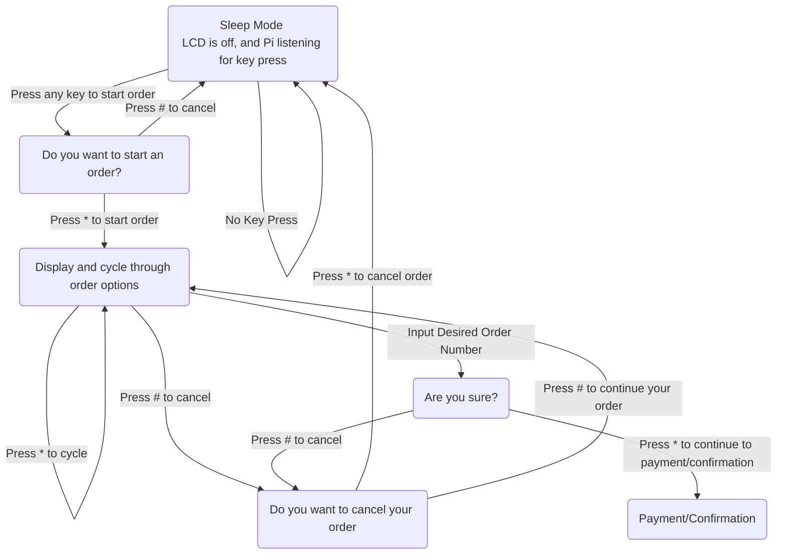

# RPIzza
Raspberry Pi pizza ordering system


## Set up RPIzza to run on startup

* need to define these steps...

## How to safely stop RPIzza

The default state of RPIzza while it's not in use is a sleep state,
where a keypress will wake the program and allow for an order to be placed.
The `kill.sh` script is used to kill a running RPIzza process like so:

```shell
bash kill.sh
```

