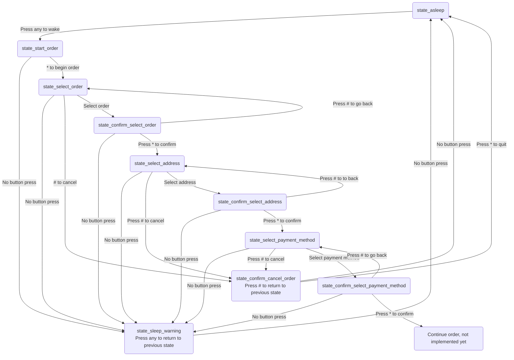

# RPIzza States

This directory stores all the states that RPIzza can be in. Each state is a function that returns a `StateTransition` variable.

## State Diagram

```mermaid

graph TD
  state_asleep(state_asleep)
  state_sleep_warning(state_sleep_warning<br>Press any to return to previous state)
  state_start_order(state_start_order)
  state_select_order(state_select_order)
  state_confirm_cancel_order(state_confirm_cancel_order<br>Press # to return to previous state)
  state_confirm_select_order(state_confirm_select_order)
  state_select_address(state_select_address)
  state_confirm_select_address(state_confirm_select_address)
  state_select_payment_method(state_select_payment_method)
  state_confirm_select_payment_method(state_confirm_select_payment_method)
  state_continue_order(Continue order, not implemented yet)

  state_asleep --> |Press any to wake| state_start_order

  state_sleep_warning --> |No button press| state_asleep

  state_start_order --> |No button press| state_sleep_warning
  state_start_order --> |* to begin order| state_select_order

  state_select_order --> |No button press| state_sleep_warning
  state_select_order --> |# to cancel| state_confirm_cancel_order
  state_select_order --> |Select order| state_confirm_select_order

  state_confirm_cancel_order --> |No button press| state_asleep
  state_confirm_cancel_order --> |Press * to quit| state_asleep

  state_confirm_select_order --> |No button press| state_sleep_warning
  state_confirm_select_order --> |Press * to confirm| state_select_address
  state_confirm_select_order --> |Press # to go back| state_select_order

  state_select_address --> |No button press| state_sleep_warning
  state_select_address --> |Press # to cancel| state_confirm_cancel_order
  state_select_address --> |Select address| state_confirm_select_address

  state_confirm_select_address --> |No button press| state_sleep_warning
  state_confirm_select_address --> |Press # to to back| state_select_address
  state_confirm_select_address --> |Press * to confirm| state_select_payment_method

  state_select_payment_method --> |No button press| state_sleep_warning
  state_select_payment_method --> |Press # to cancel| state_confirm_cancel_order
  state_select_payment_method --> |Select payment method| state_confirm_select_payment_method

  state_confirm_select_payment_method --> |No button press| state_sleep_warning
  state_confirm_select_payment_method --> |Press # to go back| state_select_payment_method
  state_confirm_select_payment_method --> |Press * to confirm| state_continue_order
```
